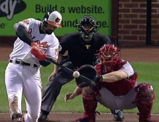

```{r setup, include=FALSE}
knitr::opts_chunk$set(echo = FALSE)
```

## Model Similarity

**Question:** How similar is the model of the NY Yankees Baseball team to the model of our home team, the Baltimore Orioles?

- Common answer: The Kullback-Leibler Divergence.
- Different answer: The number of Baltimore-half-innings we would need to simulate in order to correctly reject the model of the Yankees with given confidence level.



## Scope
- I apply statistics to _study models_, using simulated data.
- Models can come from experimental or observational data.
- Beyond baseball, my methods will work for any probabilistic model---provided you can simulate the model and compute the likelihoods of the simulations.

## Baseball Model
- Markov Chain fitted from Baltimore Orioles, batting at home (Marchi & Albert, 2013):
- Joint work: Rebeca Berger, American University, Class of 2017.
```{r bbsetup, cache=TRUE}
source('simulation.R')
source('msbaseball.R')
```
```{r bb, echo=TRUE}
sim.baseball(5, BAL, seed=1)
likes.baseball(sim.baseball(5, BAL, seed=1), BAL);
```

## New Models: t(5) and N(0,1)
```{r klisetup, cache=FALSE, message=FALSE}
source('kli.R')
```
```{r simt, echo=TRUE}
samples.t5 <- sim.t(200000, df=5, seed=7); head(samples.t5,5)
likes.t5.t5 <- likes.t(samples.t5, df=5) 
likes.t5.normal <- likes.t(samples.t5, df=Inf)
head(like.ratios(likes.t5.t5, likes.t5.normal), 5)
```
- A positive log-likelihood-ratio selects correct model.
- Adding ratios gives the log-likelihood-ratio of an ensemble.

## Density Curves: t(5) and N(0,1)
```{r densitycurves}
library(ggplot2)
densitycurve5 <- function(x) {return(dt(x,df=5))}
densitycurveinf <- function(x) {return(dt(x,df=Inf))}
ggplot(NULL,aes(c(-3,3))) +
  geom_area(stat="function",fun=densitycurve5,fill="red",alpha=I(.4),xlim = c(-3,3), show.legend=TRUE) +
  geom_area(stat="function",fun=densitycurveinf,fill="blue",alpha=I(.4),xlim=c(-3,3), show.legend=TRUE) +
  xlab("Data Point") + ylab("Density") + scale_fill_manual(name="df",values=c("red","blue"),labels=factor(c(5,Inf))) +
  theme(legend.position="right")
```

## The Bootstrap Matrix
- Each element of the $i^{th}$ column of the bootstrap matrix contains the sum of $i$ independent log-likelihood ratios.
- The rows are independent.
```{r bootstrapmatrix, echo=TRUE, cache=TRUE}
bootstrap.matrix(likes.t5.t5, likes.t5.normal,
                 max.samples=5, bootstrap.rows=7, seed=5)
```

## Proportion Correct in Each Column
```{r plotprop}
prophyp <- prop.choose.hyp(likes.t5.t5, likes.t5.normal,
                  max.samples=250, bootstrap.rows=1000, seed=5)
plot(1:250,prophyp,ylab="Proportion Correct",xlab="Sample Size", main="Based on 1000 Rows")
abline(0.95,0)
```
- Proportion is discrete (multiple of 1/#rows)---not good for regression.

## $5^{th}$ Percentile of Log-Likelihood
```{r qcplot, cache=TRUE}
quantile <- quantile.columns(likes.t5.t5, likes.t5.normal,
                  max.samples=250, bootstrap.rows=1000, seed=5,
                  confidence.level=0.95)
plot(1:250,quantile,ylab="5th Quantile",xlab="Sample Size")
abline(0,0)
```
- The "proportion correct" crosses 0.95 at the same location where the $5^{th}$ percentile (not discrete) crosses zero.

## Region of interest
```{r roiplot, cache=TRUE}
roi <- region.of.interest(likes.t5.t5, likes.t5.normal,
                  max.samples=250, bootstrap.rows=1000, seed=5,
                  confidence.level=0.95)
eq <- estimated.quantiles(likes.t5.t5, likes.t5.normal,
                  max.samples=250, bootstrap.rows=1000, seed=5,
                  confidence.level=0.95)
plot(roi[[1]],roi[[2]])
lines(eq[[1]],eq[[2]])
abline(0,0)
```
- We restrict the $5^{th}$ quantiles to a region of interest, then use regression to compute the intersection.

## Computing number of samples
```{r numberofsamples, echo=TRUE, cache=TRUE}
samples.needed(likes.t5.t5, likes.t5.normal,
                  max.samples=250, bootstrap.rows=1000, seed=5,
                  confidence.level=0.95, quantile.regression=FALSE)
```
- The following code repeats the same experiment shown above, each time drawing a new sample for bootstrapping and computing new likelihoods:
```{r repssetup}
source('reps.R')
```
```{r repeated, echo=TRUE, cache=TRUE}
repeated.estimates(reps=6, seed=1, quantile.regression=FALSE)
```
- Occasionally, the method fails and leads to nonsensical results.

## Density of Estimates
```{r repeatqr, warning=FALSE, cache=TRUE}
qr.reps <- repeated.estimates(reps=100, seed=2, 
                              quantile.regression=TRUE)
```
```{r repeatslr, echo=FALSE, warning=FALSE, cache=TRUE}
slr.reps <- repeated.estimates(reps=100, seed=2, 
                              quantile.regression=FALSE)
```
```{r bplot}
require(ggplot2)
qr.lab <- rep('quantreg::rq()',length(qr.reps))
sl.lab <- rep('quantile(); lm()',length(slr.reps))
lab <- rbind(cbind(qr.lab),cbind(sl.lab))
colnames(lab) <- 'lab'
est <- rbind(cbind(qr.reps),cbind(slr.reps))
colnames(est) <- 'est'
df <- data.frame(est, lab)
ggplot(df, aes(x=lab,y=est)) + geom_violin() + geom_boxplot(width=0.1) +
  xlab('Type of Regression') + ylab('Estimate') + 
  theme(axis.text.x=element_text(size=15))
```

## Conclusions

- We found little, if any, improvement for the quantreg::rq() function over the two step: quantile() --> lm().  Having the the result of the intermediate step allowed greater efficiency.
- Based on a distribution derived from 100 estimates, it takes $128 \pm 1$ (approximately, MEAN +/- 2 STANDARD ERROR) to correctly reject the standard Normal distribution using samples from the t-distribution with 5 degrees of freedom.
- The above result required minutes of computation, not hours, and was robust.

## Why (or Why Not) Samples Needed?


- Advantages: provides a measure of similarity between models which may be easier to interpret than the Kullback-Leibler Divergence.

- Disadvantages: harder and less natural to compute than the Kullback-Leibler divergence.


## Future Work
I am interested in models in Neuroscience where the likelihood must be approximated with Sequential Monte Carlo techniques.

## Links & Acknowledgments
- These slides can be found at http://jsm17.seancarver.org/talk.html
- My code can be found at https://github.com/seancarverphd/klir.git
- Baseball collaborator: Rebeca Berger, American University, Class of 2017.
- Baseball data (needed to run our baseball code) available from Max Marchi, see: https://github.com/maxtoki/baseball_R
- Citation: Max Marchi and Jim Albert (2013), _Analyzing Baseball With R_, CRC Press.

## Questions?

