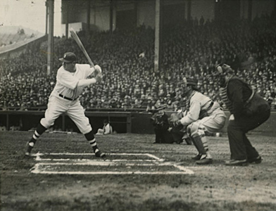
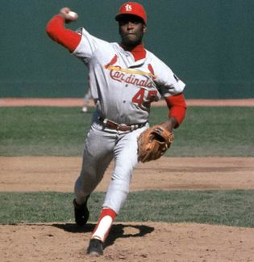

```{r setup, include=FALSE}
knitr::opts_chunk$set(echo = FALSE)
```

## Model Similarity

How similar is a model of the New York Yankees Baseball team to a model of the Baltimore Orioles?

- Common measure: Kullback-Leibler Divergence.
- More easily interpretable measure: Number of Baltimore-half-innings we would need to simulate in order to correctly reject the model of the Yankees with given confidence level.

## Concept
- We apply statistical methods to _study models_, using simulated data, rather than to study experimental or observational data.
- Models can come from experimental or observational data.
- Beyond baseball, methods can be used with all probabilistic models---but you do need to simulate the models and compute the likelihoods of the simulations.

## Simulate Baseball
- Simulate half-innings with the model of the 2011 Baltimore Orioles, batting at home (Marchi & Albert, 2013):
```{r bbsetup, cache=TRUE}
source('simulation.R')
source('msbaseball.R')
```
```{r bb, echo=TRUE}
sim.baseball(5, BAL, seed=1)
```
- Joint work: Rebeca Berger, American University, Class of 2017.

## Compute log-likelihood-ratios:
```{r klisetup, cache=FALSE, message=FALSE}
source('kli.R')
```
```{r likeratios, echo=TRUE}
innings.BAL <- sim.baseball(5, BAL, seed=1)
likes.BAL.BAL <- likes.baseball(innings.BAL, BAL); likes.BAL.BAL
likes.BAL.NYA <- likes.baseball(innings.BAL, NYA); likes.BAL.NYA
like.ratios(likes.BAL.BAL, likes.BAL.NYA)
```
## Baseball Models Require Smoothing
- Some rare transitions for Baltimore are deemed impossible---never happened---for New York.
```{r infinitelr, echo=TRUE}
innings.BAL 
BAL['23X|', '3X|']
NYA['23X|', '3X|']
```
## Multinomial Model
- Teams do not find themselves in the 23X| state very often, so the sample of transitions from that state, for a given team, in a given season, is small.

```{r transprob, echo=TRUE}
BAL['23X|', BAL['23X|',]!=0]
NYA['23X|', NYA['23X|',]!=0]
```
## Why or Why Not?



- Advantages: provides a measure of similarity between models which may be easier to interpret than the Kullback-Leibler Divergence.

- Disadvantages: harder and less natural to compute than the Kullback-Leibler divergence.

## New Models: t(5) and N(0,1)
- For a new model you need to (1) code a simulator:
```{r simt, echo=TRUE}
samples.t5 <- sim.t(5, df=5, seed=7); samples.t5
```
- And (2) code the log-likelihood of two models:
```{r, likest, echo=TRUE}
likes.t5.t5 <- likes.t(samples.t5, df=5); likes.t5.t5
likes.t5.normal <- likes.t(samples.t5, df=Inf); likes.t5.normal
```

## Density Curves: t(5) and N(0,1)

```{r densitycurves}
library(ggplot2)
densitycurve5 <- function(x) {return(dt(x,df=5))}
densitycurveinf <- function(x) {return(dt(x,df=Inf))}
ggplot(NULL,aes(c(-3,3))) +
  geom_area(stat="function",fun=densitycurve5,fill="red",alpha=I(.4),xlim = c(-3,3), show.legend=TRUE) +
  geom_area(stat="function",fun=densitycurveinf,fill="blue",alpha=I(.4),xlim=c(-3,3), show.legend=TRUE) +
  xlab("Data Point") + ylab("Density") + scale_fill_manual(name="df",values=c("red","blue"),labels=factor(c(5,Inf))) +
  theme(legend.position="right")
```

## Log-likelihood-ratios

- Log-likelihood-ratios (difference in log-likelihoods):
```{r likeratiostn, echo=TRUE}
like.ratios(likes.t5.t5, likes.t5.normal)
```

## AIC and Kullback-Leiber Divergence

- Akaike information criterion (sum of log-likelihood ratios, because we do not fit parameters):
```{r aictn, echo=TRUE}
aic(likes.t5.t5, likes.t5.normal)
```
- Kullback-Leibler Divergence (mean of log-likelihood ratios, estimate based on Monte Carlo integration):
```{r kltn, echo=TRUE}
KL.estimate(likes.t5.t5, likes.t5.normal)
```

## A Larger Sample

We compute a larger sample of log-likelihoods for a bootstrap:
```{r bootstrapsample, echo=TRUE, cache=TRUE}
bs.t5 <- sim.t(200000, df=5, seed=2)
ll.t5.t5 <- likes.t(bs.t5, df=5)
ll.t5.normal <- likes.t(bs.t5, df=Inf)
```

## The Bootstrap Matrix

- Each element of the $i^{th}$ column of the bootstrap matrix contains the sum of $i$ independent log-likelihood ratios.
- The rows are independent.
```{r bootstrapmatrix, echo=TRUE, cache=TRUE}
bootstrap.matrix(ll.t5.t5, ll.t5.normal,
                 max.samples=5, bootstrap.rows=7, seed=5)
```

## Select Correct Model?
```{r chm, echo=TRUE, cache=TRUE}
choose.hyp.matrix(ll.t5.t5, ll.t5.normal,
                  max.samples=5, bootstrap.rows=7, seed=5)
```
## Count and Proportion of Choose Correct Model
```{r counthm, echo=TRUE, cache=TRUE}
count.choose.hyp(ll.t5.t5, ll.t5.normal,
                  max.samples=5, bootstrap.rows=7, seed=5)
prop.choose.hyp(ll.t5.t5, ll.t5.normal,
                  max.samples=5, bootstrap.rows=7, seed=5)
prop.choose.hyp(ll.t5.t5, ll.t5.normal,
                  max.samples=5, bootstrap.rows=1000, seed=5)
```

## Quantiles of Columns
- The quantile.columns list the value for which 95% (or some other confidence level) of the summed likelihood ratios is above that value.
```{r qc, echo=TRUE, cache=TRUE}
quantile.columns(ll.t5.t5, ll.t5.normal,
                  max.samples=5, bootstrap.rows=1000, seed=5,
                  confidence.level=0.95)
```

## Plot of $5^{th}$ quantile
```{r qcplot, cache=TRUE}
quantile <- quantile.columns(ll.t5.t5, ll.t5.normal,
                  max.samples=250, bootstrap.rows=1000, seed=5,
                  confidence.level=0.95)
plot(1:250,quantile,ylab="5th Quantile",xlab="Sample Size")
abline(0,0)
```
- For what sample size does the $5^{th}$ quantile cross zero? It's the number of samples needed to be 95% confident.

## Region of interest
```{r roiplot, cache=TRUE}
roi <- region.of.interest(ll.t5.t5, ll.t5.normal,
                  max.samples=250, bootstrap.rows=1000, seed=5,
                  confidence.level=0.95)
eq <- estimated.quantiles(ll.t5.t5, ll.t5.normal,
                  max.samples=250, bootstrap.rows=1000, seed=5,
                  confidence.level=0.95)
plot(roi[[1]],roi[[2]])
lines(eq[[1]],eq[[2]])
abline(0,0)
```
- We restrict the $5^{th}$ quantiles to a region of interest, then use regression to compute the intersection.

## Computing number of samples
```{r numberofsamples, echo=TRUE, cache=TRUE}
samples.needed(ll.t5.t5, ll.t5.normal,
                  max.samples=250, bootstrap.rows=1000, seed=5,
                  confidence.level=0.95, quantile.regression=FALSE)
```
- The following code repeats the same experiment shown above, each time drawing a new sample for bootstrapping and computing new likelihoods:
```{r repssetup}
source('reps.R')
```
```{r repeated, echo=TRUE, cache=TRUE}
repeated.estimates(reps=6, seed=1, quantile.regression=FALSE)
```
- Occasionally, the method fails and leads to nonsensical results.

## Testing quantile regression.
- We apply the rq() function of CRAN quantreg package.
- May be the wrong choice!

## Performance of Estimator with Quantile Regression
```{r repeatqr, echo=TRUE, warning=FALSE, cache=TRUE}
qr.reps <- repeated.estimates(reps=100, seed=2, 
                              quantile.regression=TRUE)
head(qr.reps)
mean(qr.reps)
sd(qr.reps)
```
```{r repeatslr, echo=FALSE, warning=FALSE, cache=TRUE}
slr.reps <- repeated.estimates(reps=100, seed=2, 
                              quantile.regression=FALSE)
```


## Violin Plot of Estimates
```{r bplot}
require(ggplot2)
qr.lab <- rep('Quantile',length(qr.reps))
sl.lab <- rep('Simple',length(slr.reps))
lab <- rbind(cbind(qr.lab),cbind(sl.lab))
colnames(lab) <- 'lab'
est <- rbind(cbind(qr.reps),cbind(slr.reps))
colnames(est) <- 'est'
df <- data.frame(est, lab)
ggplot(df, aes(x=lab,y=est)) + geom_violin() + geom_boxplot(width=0.1) +
  xlab('Type of Regression') + ylab('Estimate')
```

## Conclusions

- It takes $128 \pm 1$ samples to reject the standard Normal distribution using samples from the t-distribution with 5 degrees of freedom.
- Our result required minutes of computation, and was robust.
- We found only a modest improvement, if any, for quantile regression over simple linear regression.

## Future Work

- Loose ends: improve efficiency and robustness; parallelize algorithm.
- Baseball models, including smoothing.  Joint work with Rebeca Berger.
- Ion channels (continuous time Markov chain, with hidden states).
- Substantial new direction: apply to models (e.g. Hodgkin-Huxley with channel noise), where likelihoods must be approximated with sequential Monte Carlo methods.  Derive rigorous bounds on number of samples needed.

## Acknowledgments

- These slides can be found at http://jsm17.seancarver.org/.
- The code can be found at https://github.com/seancarverphd/klir.git
- Baseball data available from Max Marchi, see: https://github.com/maxtoki/baseball_R
- Citation: Max Marchi and Jim Albert (2013), _Analyzing Baseball With R_, CRC Press.
- Baseball collaborator: Rebeca Berger, American University, Class of 2017.

## Questions?

